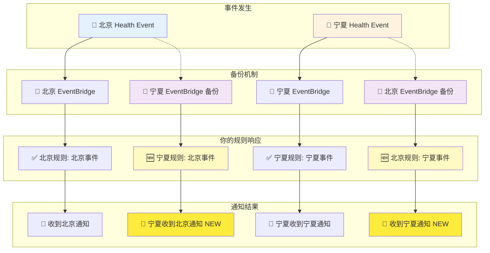

# AWS Health Dashboard EventBridge 规则变更通知

## 📋 变更概述

AWS将在**2025年10月31日**对中国区域的Health Dashboard EventBridge集成引入备份机制，这将改变现有EventBridge规则的行为。

### 关键变化
- **当前行为**: EventBridge规则只接收本区域的健康事件
- **新行为**: EventBridge规则将接收本区域+备份区域的健康事件
- **备份关系**: 宁夏区域成为北京区域的备份区域

### 影响范围
如果你在北京区域有Health Dashboard的EventBridge规则，从10月31日开始，这些规则也会接收到宁夏区域的健康事件。

## 🔄 行为变化详解

### 当前行为（2025年10月31日前）

| 🏢 **北京区域** | 🏢 **宁夏区域** |
|---|---|
| 北京Health事件 → 北京EventBridge → ✅ **你的规则触发** → 📧 收到通知 | 宁夏Health事件 → 宁夏EventBridge → ❌ **你的北京规则不触发** |
| **结果**: 只收到北京区域的健康事件通知 | **结果**: 北京区Event-Bridge不会收到宁夏区域的健康事件通知 |

### 新行为（2025年10月31日后 - 不修改规则）



### 解决方案对比

| ✅ **选项1: 添加区域过滤器（推荐）** | ⚠️ **选项2: 不修改规则** |
|---|---|
| 🔧 修改EventBridge规则 | 🤷 保持现状不变 |
| 📝 添加 `eventRegion` 过滤器 | � 开始e接收两个区域的事件 |
| ✅ 只收到本区域事件 | ⚠️ 可能收到重复通知 |
| 😊 **保持原有行为不变** | � **需要实现去重处理逻辑** |
| **优点**: 简单、可靠、无副作用 | **优点**: 无需修改配置 |
| **缺点**: 需要手动修改规则 | **缺点**: 需要处理重复事件，增加复杂性 |

## 🎯 推荐解决方案

### 方案1: 添加区域过滤器（推荐）

在EventBridge规则的事件模式中添加区域过滤器：

**北京区域规则**:
```json
{
  "source": ["aws.health"],
  "detail-type": ["AWS Health Event"],
  "detail": {
    "service": ["EBS"],
    "eventTypeCategory": ["issue"],
    "eventTypeCode": ["AWS_EBS_DEGRADED_EBS_VOLUME_PERFORMANCE"],
    "eventRegion": ["CN-NORTH-1"]  // 添加这行过滤器
  }
}
```

**宁夏区域规则**（如果有）:
```json
{
  "source": ["aws.health"],
  "detail-type": ["AWS Health Event"],
  "detail": {
    "service": ["EBS"],
    "eventTypeCategory": ["issue"],
    "eventTypeCode": ["AWS_EBS_DEGRADED_EBS_VOLUME_PERFORMANCE"],
    "eventRegion": ["CN-NORTHWEST-1"]  // 添加这行过滤器
  }
}
```

### 方案2: 利用高可用性（高级用户）

如果你想利用备份机制的高可用性，可以接收两个区域的事件，但需要：

1. 使用 `detail.communicationId` 进行去重
2. 实现重复事件检测逻辑
3. 设置适当的告警阈值

## 🧪 测试脚本

我们提供了一个测试脚本来帮助你验证EventBridge规则的行为变化。

### 文件说明

- `health-event-test.py` - 主测试脚本
- `requirements.txt` - Python依赖
- `README.md` - 本文档

### 测试目的

1. **建立行为基准**: 记录当前EventBridge规则的实际行为
2. **监测变化**: 10月31日后检测行为是否发生变化
3. **验证解决方案**: 测试区域过滤器的效果

### 使用方法

#### 1. 环境准备
```bash
# 确保AWS CLI已配置
aws configure

# 安装Python依赖
pip3 install -r requirements.txt

# 检查权限（需要EventBridge和SQS权限）
aws sts get-caller-identity
```

#### 2. 测试当前行为（建立基准）
```bash
# 记录当前行为作为基准
python3 health-event-test.py --test-type current
```

**预期结果**（10月31日前）:
- 北京规则接收北京事件: 1条 ✅
- 北京规则接收宁夏事件: 0条 ✅
- 宁夏规则接收北京事件: 0条 ✅
- 宁夏规则接收宁夏事件: 1条 ✅

#### 3. 监测行为变化（10月31日后）
```bash
# 10月31日后运行相同测试
python3 health-event-test.py --test-type current
```

**如果出现跨区域事件**:
- 北京规则接收宁夏事件: >0条 ⚠️
- 宁夏规则接收北京事件: >0条 ⚠️

说明备份机制已生效，需要添加区域过滤器。

#### 4. 验证过滤器效果
```bash
# 测试区域过滤器方案
python3 health-event-test.py --test-type filter
```

**预期结果**:
- 即使模拟备份机制，过滤器确保只接收本区域事件

### 测试流程

1. **资源创建**: 自动在北京和宁夏区域创建SQS队列和EventBridge规则
2. **事件发送**: 模拟发送Health事件到指定区域
3. **结果检查**: 实时监控队列消息，分析接收情况
4. **结果验证**: 对比实际结果与预期行为
5. **资源清理**: 自动删除所有创建的测试资源

### 测试输出示例

```
🚀 EventBridge Health 实际行为测试
测试ID: real-test-a1b2c3
测试时间: 2025-08-05 15:30:00
==================================================

============================================================
🧪 测试当前实际行为
   这个测试反映了当前系统的真实行为
   10月31日后运行同样的测试，结果可能会不同

📋 在北京区域创建测试环境
  ✅ 队列: real-test-a1b2c3-beijing
  ✅ 规则: real-test-a1b2c3-rule-beijing

📋 在宁夏区域创建测试环境
  ✅ 队列: real-test-a1b2c3-ningxia
  ✅ 规则: real-test-a1b2c3-rule-ningxia

📤 发送测试事件:
  📤 向北京区域发送北京区域事件: real-abc12345
  📤 向宁夏区域发送宁夏区域事件: real-def67890

📊 检查接收结果:
  🔍 检查北京区域队列...
  🔍 检查宁夏区域队列...

📋 当前行为测试结果:
  北京规则接收北京事件: 1 条
  北京规则接收宁夏事件: 0 条
  宁夏规则接收北京事件: 0 条
  宁夏规则接收宁夏事件: 1 条

💡 结果分析:
  ✅ 符合当前预期：各区域只接收本区域事件
  📝 这表明备份机制尚未启用

🎯 测试建议:
   1. 保存这个测试结果
   2. 在2025年10月31日后重新运行相同测试
   3. 对比结果，如果出现跨区域事件，请添加区域过滤器
   4. 运行 --test-type filter 验证过滤器效果

🧹 清理测试资源...
  ✅ 删除北京规则: real-test-a1b2c3-rule-beijing
  ✅ 删除北京队列: real-test-a1b2c3-beijing
  ✅ 删除宁夏规则: real-test-a1b2c3-rule-ningxia
  ✅ 删除宁夏队列: real-test-a1b2c3-ningxia

🎉 测试完成！
```

## 📅 行动计划

### 立即行动（现在 - 10月31日前）

1. **运行基准测试**
   ```bash
   python3 realistic-test.py --test-type current
   ```

2. **检查现有规则**
   - 登录AWS控制台
   - 查看EventBridge规则列表
   - 识别Health Dashboard相关规则

3. **准备修改方案**
   - 确定需要添加过滤器的规则
   - 准备修改脚本或手动操作步骤

### 10月31日后

1. **重新运行测试**
   ```bash
   python3 realistic-test.py --test-type current
   ```

2. **对比结果**
   - 如果出现跨区域事件，立即添加过滤器
   - 如果结果相同，继续监控

3. **验证修改效果**
   ```bash
   python3 realistic-test.py --test-type filter
   ```

## 🔧 所需权限

测试脚本需要以下AWS权限：

```json
{
  "Version": "2012-10-17",
  "Statement": [
    {
      "Effect": "Allow",
      "Action": [
        "events:PutRule",
        "events:DeleteRule", 
        "events:PutTargets",
        "events:RemoveTargets",
        "events:PutEvents",
        "sqs:CreateQueue",
        "sqs:DeleteQueue",
        "sqs:SetQueueAttributes",
        "sqs:ReceiveMessage",
        "sqs:DeleteMessage",
        "sts:GetCallerIdentity"
      ],
      "Resource": "*"
    }
  ]
}
```

## ❓ 故障排除

**问题**: 权限不足  
**解决**: 确保AWS凭证具有上述所需权限

**问题**: 区域不可用  
**解决**: 检查AWS CLI配置的区域设置

**问题**: 事件未接收到  
**解决**: 检查EventBridge规则和SQS队列配置，增加等待时间

**问题**: 资源清理失败  
**解决**: 手动删除残留的测试资源（以real-test-开头的资源）

## 📞 支持

如果你有任何问题或疑虑，请联系亚马逊云科技中国支持团队。

## 📚 参考资料

- [Amazon Health 事件 Amazon EventBridge 架构](https://docs.amazonaws.cn/health/latest/ug/aws-health-events-eventbridge-schema.html)
- [AWS EventBridge 用户指南](https://docs.aws.amazon.com/eventbridge/)
- [AWS Health Dashboard 文档](https://docs.aws.amazon.com/health/)